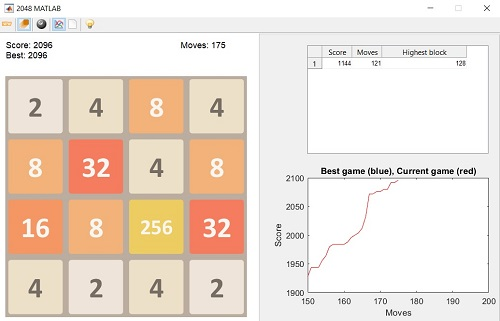

# Matlab 2048

 2048 Game in Matlab ( With AI )

## Run

Open matlab and run `play2048.m` to play the game.

## AI

AI is developing right now ...

## Support

 

## Contributing

1. Fork it !
2. Create your feature branch : `git checkout -b my-new-feature`
3. Commit your changes : `git commit -am 'Add some feature'`
4. Push to the branch : `git push origin my-new-feature`
5. Submit a pull request :D

## Issues

Each project may have many problems. Contributing to the better development of this project by reporting them.